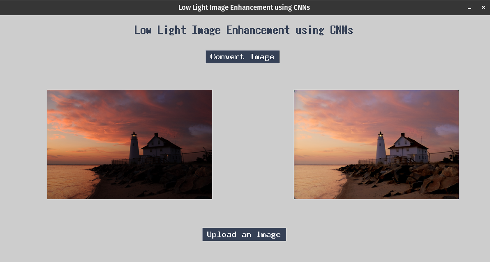

# MBLLEN

This is a Keras implementation of “MBLLEN: Low-light Image/Video Enhancement Using CNNs” in BMVC 2018, by [Feifan Lv](https://lvfeifan.github.io/), [Feng Lu](http://shi.buaa.edu.cn/lufeng/), Jianhua Wu and Chongsoon Lim. This page provides more experiments on real low-light images compared with latest methods.

**[Paper](http://bmvc2018.org/contents/papers/0700.pdf), [Dataset](https://drive.google.com/file/d/1U1hyvVktYEoK_3cdcbWNaJ1WDft2mLRl/view?usp=sharing) and [Project page](http://phi-ai.buaa.edu.cn/project/MBLLEN/index.htm)**

## Requirements ##

- [x] python 3  
- [x] Tensorflow 1.6.0
- [x] Keras 2.2.0
- [x] Opencv-python 3.4.2

## Usage ##

#### Testing
You can run the Gui made in tkinter by going to the ```main/``` folder and then
```
python gui.py
```



By default, the code takes the photo that you upload, loads the "10_dark_base.h5" model and saves results in the "../result/" folder.  Please read the code to see other parameter settings. 

#### Training:

First, prepare your own dataset or download our synthetic low-light dataset from our [Project page](http://phi-ai.org/project/MBLLEN/default.htm). Second, change the load images path of "train.py" and "data_load.py". Then, you can just run through

```shell
cd main
python train.py
```

By default, the code takes the data in the "../dataset/" folder and save weights in the "./models/" folder. Please read the code to see other parameter settings.


## Model

- [x] Syn_img_lowlight_withnoise.h5  (This model is trained using synthetic lowlight images based on Poisson noise model. It is using for enhancement and denoising simultaneously.)
- [x] Syn_img_lowlight.h5  (This model is trained using synthetic lowlight images without additional noise. It is using only for enhancement.)
- [x] LOL_img_lowlight.h5  (This model is fine-tuned using LOL Dataset.)

## Related Follow-Up Work

Feifan Lv, Yu Li and Feng Lu. Attention Guided Low-light Image Enhancement with a Large Scale Low-light Simulation Dataset. IJCV, 2021. **[Paper](https://arxiv.org/abs/1908.00682) and [Project page](http://phi-ai.buaa.edu.cn/project/AgLLNet/index.htm)**

